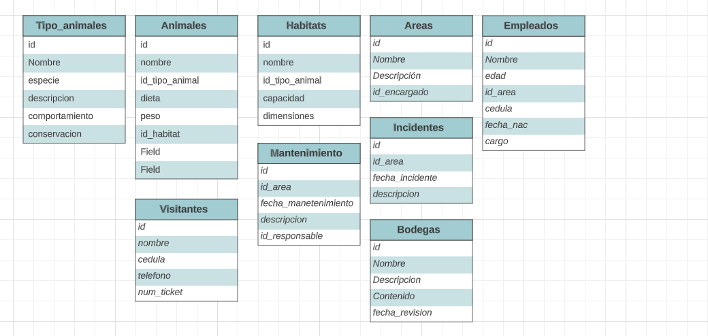

# Proyecto Zoológico Campus:sparkles:

### ¿Qué es un zoológico?

Un zoológico es un lugar donde se cuidan, rehabilitan y exhiben animales con fines de entretenimiento, educación y conservación. Para gestionar  eficientemente todas las operaciones relacionadas con los animales, su  cuidado, las exhibiciones y la experiencia de los visitantes, se  necesita una infraestructura física y digital interconectada.

### Nuestro enfoque

Al administrar un zoológico, abordamos múltiples aspectos cruciales para un funcionamiento eficiente y una experiencia excepcional. Esto incluye:

1. #### **Datos sobre los Animales**   :bear:

   - Almacena detalles vitales de cada animal.
   - Ayuda a cuidadores y veterinarios a brindar atención precisa.

2. #### **Controlando Hábitats**   :national_park:

   - Ajusta automáticamente las condiciones de los hábitats.
   - Proporciona un ambiente natural y seguro para los animales.

3. #### **Manejo de Visitantes**  :family_man_woman_boy_boy:

   - Facilita la compra y entrada de visitantes.
   - Mejora la experiencia de los visitantes y gestiona la afluencia.

4. #### **Reservas para Eventos y Aprendizaje**  :tickets:

   - Registra inscripciones en clases y eventos.
   - Organiza actividades especiales de manera eficiente.

5. #### **Información para los Visitantes**  :information_desk_person:

   - Ofrece detalles sobre animales y exhibiciones.
   - Enriquece la experiencia de los visitantes.

6. #### **Mantenimiento de la Seguridad**  :lock:

   - Monitorea y asegura la seguridad de todos.
   - Previene incidentes y actúa en emergencias.

7. #### **Operaciones Comerciales**  :moneybag:

   - Gestiona pedidos de alimentos y tiendas.
   - Mejora la eficiencia y la satisfacción de los visitantes.

8. #### **Organización del Personal** :man_factory_worker:

   - Programa turnos y registra horas trabajadas.
   - Optimiza la planificación del personal.

Al observar la relevancia de estos aspectos, hemos optado por  dirigir nuestra atención hacia la identificación, mitigación de riesgos, y la la capacidad de abordar eficazmente cualquier desafío que pueda surgir en las instalaciones y hábitats del zoológico.

## Sistema de Gestión de Mantenimiento y Detección de Problemas :hammer::gear:

El Sistema de Gestión de Mantenimiento y Detección de Problemas para Zoológicos es un sistema diseñado para ayudar a los zoológicos en la planificación, seguimiento y resolución de mantenimientos, así como en la detección temprana y gestión eficiente de problemas en las diferentes áreas del zoológico. 

## Características

- **Gestión de Áreas:** Registre y administre información detallada sobre las áreas del zoológico, incluyendo nombres, descripciones, horarios de mantenimiento programado y capacidad de visitantes.

- **Registro de Mantenimientos:** Lleve un registro exhaustivo de los mantenimientos realizados en las áreas del zoológico. Incluya información sobre el área afectada, fecha del mantenimiento, descripción del trabajo y personal responsable.

- **Seguimiento de Incidentes:** Registre y supervise cualquier incidente o problema que ocurra en relación con las áreas del zoológico. Mantenga un historial de fechas, descripciones y acciones tomadas para resolver los incidentes.

- **Auditorías de Áreas:** Realice auditorías periódicas de áreas y procesos para garantizar el cumplimiento de los estándares de mantenimiento y seguridad. Documente observaciones y recomendaciones para mejoras.

- **Notificaciones Automáticas:** Reciba alertas automáticas sobre eventos importantes, como mantenimientos próximos, recordatorios de auditorías y cambios en los horarios de mantenimiento. Manténgase informado en tiempo real.

  

## Cómo Ayuda al Zoológico

El Sistema de Gestión de Mantenimiento y Detección de Problemas ofrece varias ventajas clave para el zoológico:

- **Eficiencia en el Mantenimiento:** El zoológico puede programar y realizar mantenimientos de manera planificada, evitando interrupciones no planificadas en la operación diaria.

- **Detección Temprana de Problemas:** Los incidentes y problemas pueden ser identificados y abordados en etapas tempranas, minimizando su impacto y reduciendo el riesgo para visitantes, personal y animales.

- **Historial Detallado:** La base de datos mantiene un registro histórico detallado de todos los mantenimientos, incidentes y auditorías, lo que permite un seguimiento completo de la gestión de áreas.

- **Cumplimiento de Estándares:** Las auditorías programadas garantizan que las áreas del zoológico cumplan con los estándares de mantenimiento y seguridad, creando un entorno más seguro y atractivo para los visitantes.

  
